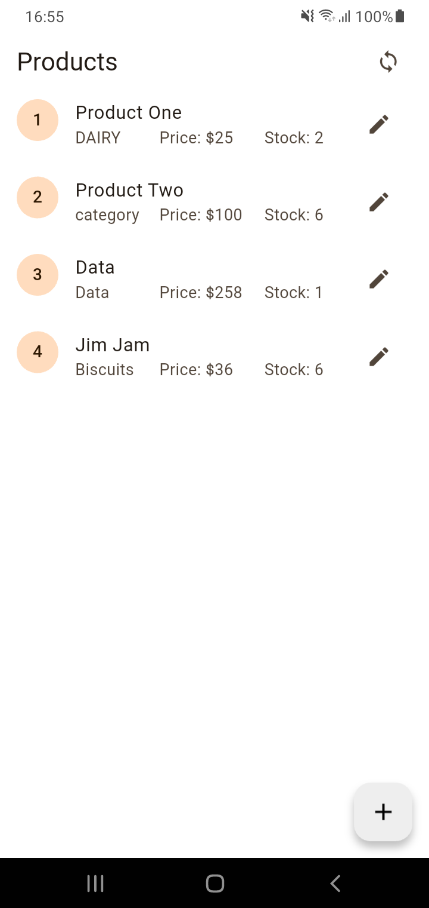
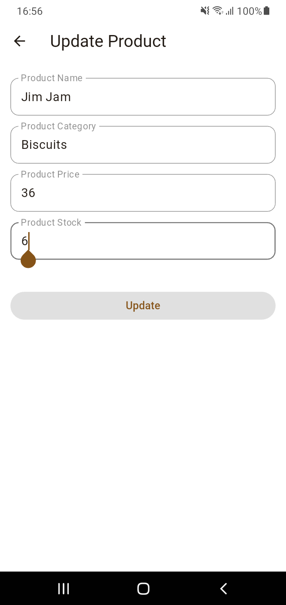

# demo_sqlite

A new Flutter project demonstrating the usage of SQLite for local database operations.

## Screenshots
<div>


</div>  

## Getting Started

This project is a starting point for a Flutter application.

### Prerequisites

Before you begin, make sure you have the following installed on your machine:
- Flutter SDK
- Dart SDK
- SQLite Database plugin (`sqflite`)

### Installation

1. Clone this repository:
   ```bash
   git clone https://github.com/vinit-401/sqflite-demo
